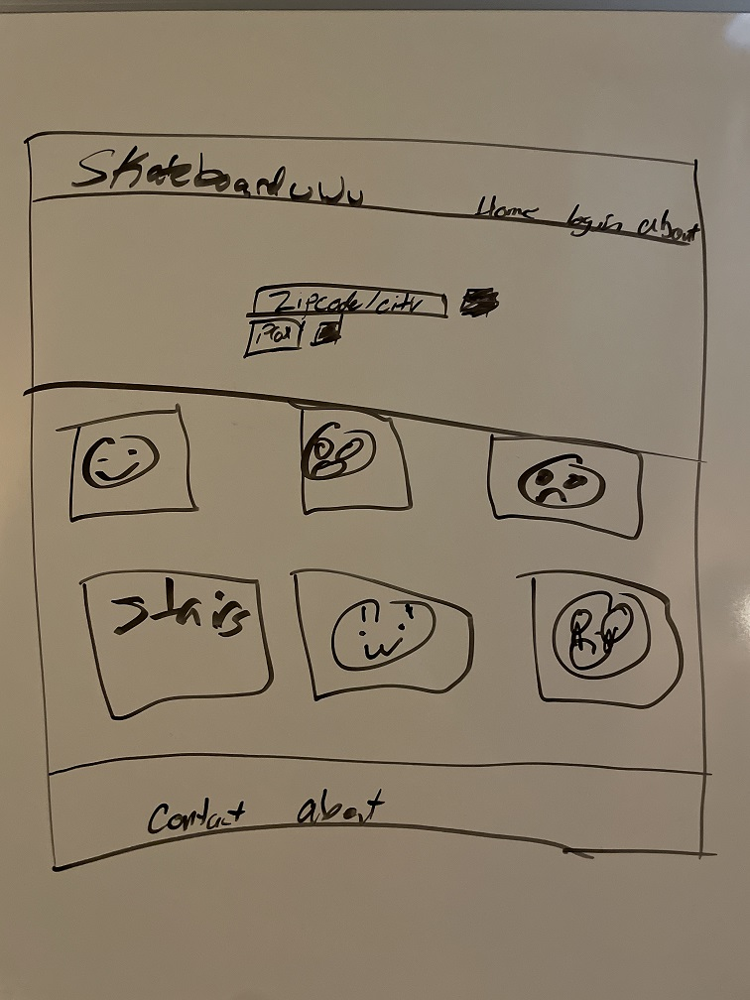
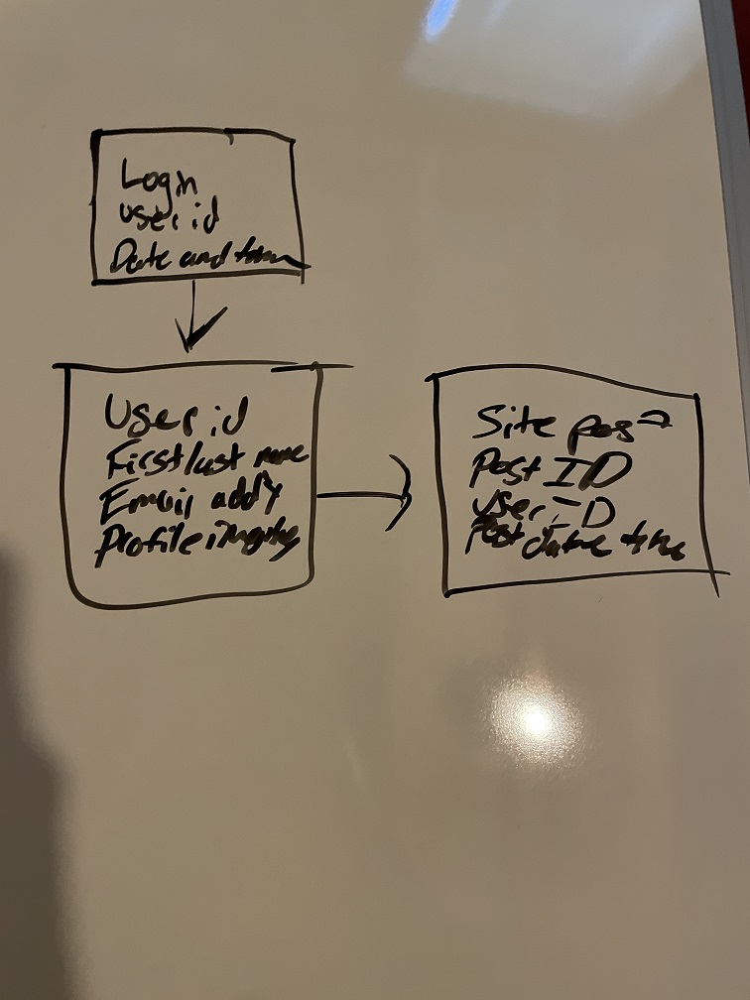
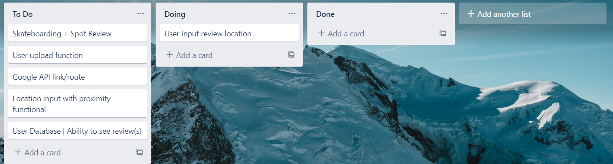

# User Story

As a (skating) user I want to be able to search for skating locations so that I can be directed to and review the location 

# Acceptance Criteria

### Given 
The user navigates the app and can access the site

### When
The user navigates app they will find a search bar for skating spots

### Then
The app will send a result of skating spots

### And
The user will receive the ability to rate and review the found locations

# Wireframe (Can be minimal)

# DB structure

# Screenshot of Kanban Board

# Breakdown of tasks
Chad: Routes
John: 
Miguel: API 
Carl: 

Skateboarding + Spot Review 
User input reviews locations, search
Users can upload a specific spot, linking the google map API so they can pinpoint 
Put in your location, proximity of how far it is, put in your zipcode/address, and it'll give you all of the spots any other user put in
